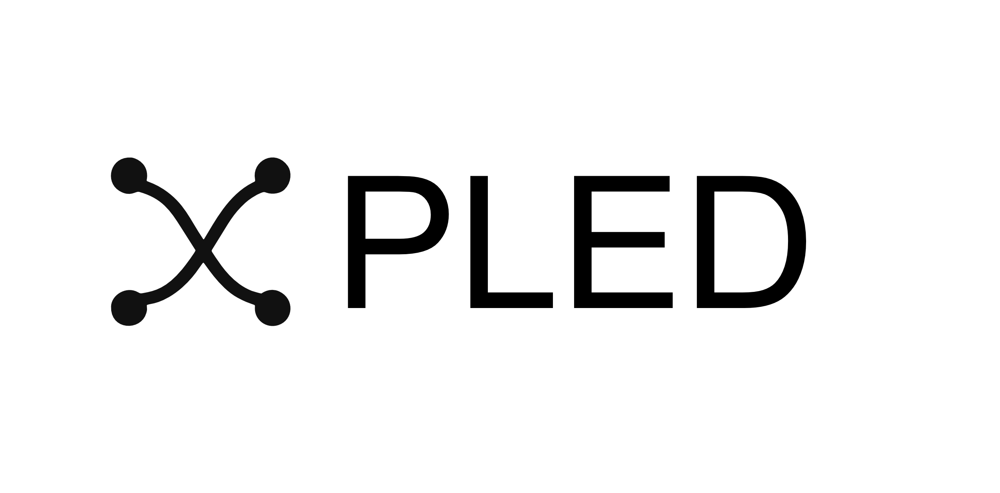

## Encode × Arc DeFi Hackathon Challenges
GAETANO MONDELLI · NOV 14, 2025

## Description

<!-- incliide imaghe pledLOGO.png --> 

Everything in the real world starts as a claim: "you own this, you belong to this community, you earned that, you completed the work, you deserve a payment". Claims aren't always quantitative or certain, and that ambiguity is part of reality. PLED  brings that on-chain by reconciling off-chain evidence into a tokenized claim with a Reliability Index that captures confidence rather than pretending certainty.

## ARC

Arc is built to connect programmable money with the real economy.

##  Here’s why it matters:
- Use stablecoins as native gas - You pay fees in USDC, not volatile tokens. Costs stay predictable and low.
- Enable sub‑second finality - Transactions confirm instantly thanks to the Malachite BFT engine, making real‑time finance possible.
- Have privacy when you need it - Shield balances and transactions selectively while still staying compliant.
- You're plugged into Circle’s ecosystem - Full access to USDC, EURC, USYC, wallets, CCTP and more, giving you global liquidity from day one.
- This is built for real‑world finance - Arc is designed for lending, payments, FX, capital markets, and everything financial that actually touches businesses and users

##  Build DeFi Solutions in the Encode × Arc DeFi Hackathon
Whether you’re shipping DeFi, payments, or something entirely new, Arc gives you infrastructure built for scale, speed and real adoption.

## TRACKS

### Best Smart Contracts on Arc with Advanced Stablecoin Logic

Build and deploy smart contracts on Arc that demonstrate advanced programmable logic using USDC or EURC stablecoins.
The goal is to showcase how stablecoins can be used with complex logic to create automated financial systems. Your contract should solve a real problem or create new functionality by combining stablecoins with smart contract conditions, automation, or cross-chain capabilities. Show us how programmable money can work in ways that aren't possible with traditional systems.

### Requirements
- Deploy on Arc blockchain
- Use USDC and/or EURC
- Include programmable logic beyond basic transfers

### Best Cross-Chain USDC Experience with Circle's Bridge Kit and Arc

Create an application that enables users to move USDC between supported networks using Bridge Kit and Arc.
The goal is to build an application that makes cross-chain USDC transfers easy to use. Your solution should focus on user experience - making it simple, fast, and reliable for users to move their USDC across different blockchain networks. Think about reducing friction, providing clear feedback, and handling the complexity of cross-chain operations behind the scenes so users don't have to worry about the technical details.

### Requirements
- Must integrate Circle's Bridge Kit
- Must support USDC transfers with Arc
- Must work across multiple supported networks
- Focus on user experience and ease of use

### Best Smart Contract Wallet Infrastructure for Treasury Management with Gateway & Arc
Design a smart contract–based treasury system using Circle Gateway and Arc to automate allocations, distributions, and onchain treasury operations.
Build infrastructure that helps organizations manage their treasury through smart contracts. Your system should automate how funds are allocated, distributed, and managed on-chain. Think about solving real treasury problems: automated payroll, budget allocations across departments, scheduled distributions, multi-signature approvals, or programmatic fund management based on rules or triggers.

### Requirements
- Must use Circle Gateway and Arc
- Treasury operations must be automated through smart contracts
- Must handle allocations and distributions
- Code must be functional and deployed

### Best Stablecoin Embedded Wallet Experience with Circle Wallets, CCTP, Gateway & Arc
Develop an embedded wallet experience that leverages Circle Wallets, CCTP, and Gateway to enable cross-chain USDC transfers and in-app payments.
Build a wallet that lives inside an application, making it easy for users to manage USDC without leaving your app. Your solution should integrate Circle's wallet infrastructure to handle cross-chain transfers and payments directly within your application. Focus on making the wallet feel native to your app — users shouldn't need to understand the underlying blockchain complexity to send, receive, or move their USDC across networks.

### Requirements
- Must use Circle Wallets, CCTP, Gateway, and Arc
- Wallet must be embedded within an application
- Must support cross-chain USDC transfers
- Must enable in-app payments
- Focus on user experience within the application